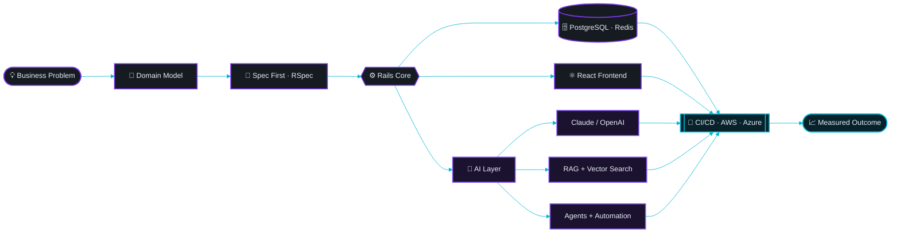
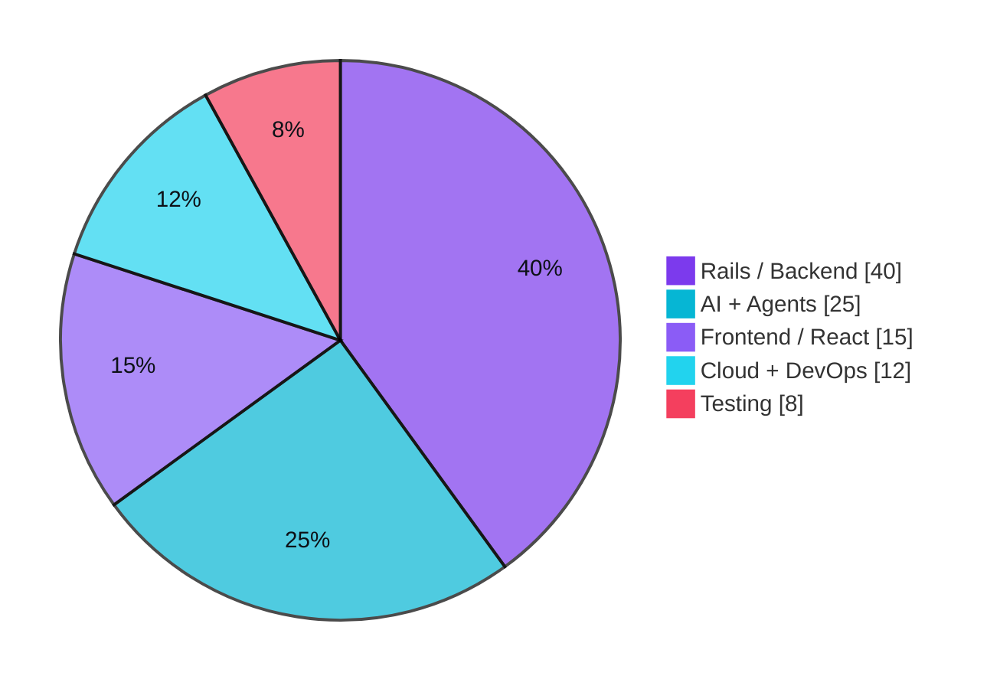

<!-- ═══════════════════════════ HEADER ═══════════════════════════ -->

<div align="center">
  
</div>

<div align="center">
  <a href="https://waseemakram.cc">
    
  </a>
</div>

<div align="center">

<a href="https://waseemakram.cc"></a>
<a href="https://linkedin.com/in/waseem-akram15"></a>
<a href="mailto:seemakram15@gmail.com"></a>


</div>

<div align="center">
  
</div>

<!-- ═══════════════════════════ ABOUT ═══════════════════════════ -->

<h2 align="center">👨‍💻 &nbsp;whoami</h2>

<table>
<tr>
<td width="60%" valign="top">

```ruby
class WaseemAkram < Developer
  ROLE  = "Full-Stack Engineer · AI Builder"
  STACK = %w[Rails React PostgreSQL Redis AWS]

  def currently_building
    [
      "Enterprise-grade web platforms",
      "AI agents & agentic workflows",
      "RAG pipelines over private data"
    ]
  end

  def ask_me_about
    %i[rails react system_design
       llm_integration api_architecture]
  end

  def reach_me
    { web:   "waseemakram.cc",
      mail:  "seemakram15@gmail.com",
      linkedin: "waseem-akram15" }
  end
end
```

</td>
<td width="40%" valign="top">

**Focus right now**

`🔭` Enterprise web apps + AI products
`🤖` LLMs · Agents · RAG · Automation
`🌱` Agentic AI & multi-agent systems
`⚡` Performance & database architecture
`🧪` TDD with RSpec, CI/CD pipelines
`💬` Rails · React · System design

**Working style**

`▸` Ship small, ship often
`▸` Boring tech, clever architecture
`▸` Tests before confidence
`▸` Business outcome > line count

</td>
</tr>
</table>

<div align="center">
  
</div>

<!-- ═══════════════════════════ TECH ═══════════════════════════ -->

<h2 align="center">⚙️ &nbsp;Tech Arsenal</h2>

<table align="center">
  <tr>
    <td align="right" width="190"><b>Languages</b>&nbsp;&nbsp;</td>
    <td align="left"></td>
  </tr>
  <tr>
    <td align="right"><b>Frameworks</b>&nbsp;&nbsp;</td>
    <td align="left"></td>
  </tr>
  <tr>
    <td align="right"><b>Data &amp; APIs</b>&nbsp;&nbsp;</td>
    <td align="left"></td>
  </tr>
  <tr>
    <td align="right"><b>Cloud &amp; DevOps</b>&nbsp;&nbsp;</td>
    <td align="left"></td>
  </tr>
  <tr>
    <td align="right"><b>Tooling</b>&nbsp;&nbsp;</td>
    <td align="left"></td>
  </tr>
</table>

<div align="center">
  <br />
  
  
  
  
  
  <br />
  
  
  
  
  
  <br />
  
  
  
  
  
</div>

<div align="center">
  
</div>

<!-- ═══════════════════════════ PROFICIENCY ═══════════════════════════ -->

<h2 align="center">📊 &nbsp;Proficiency Map</h2>

<table align="center">
  <tr>
    <th align="left" width="150">Core Engineering</th>
    <th width="180"></th>
    <th width="60"></th>
    <th width="40"></th>
    <th align="left" width="150">AI &amp; Platform</th>
    <th width="180"></th>
    <th width="60"></th>
  </tr>
  <tr>
    <td>Ruby on Rails</td><td><code>███████████████████░</code></td><td align="right"><b>96%</b></td>
    <td></td>
    <td>LLM Integration</td><td><code>██████████████████░░</code></td><td align="right"><b>92%</b></td>
  </tr>
  <tr>
    <td>PostgreSQL / SQL</td><td><code>██████████████████░░</code></td><td align="right"><b>92%</b></td>
    <td></td>
    <td>AI Agents</td><td><code>█████████████████░░░</code></td><td align="right"><b>88%</b></td>
  </tr>
  <tr>
    <td>API Architecture</td><td><code>██████████████████░░</code></td><td align="right"><b>90%</b></td>
    <td></td>
    <td>RAG Pipelines</td><td><code>█████████████████░░░</code></td><td align="right"><b>85%</b></td>
  </tr>
  <tr>
    <td>JavaScript ES6+</td><td><code>█████████████████░░░</code></td><td align="right"><b>88%</b></td>
    <td></td>
    <td>System Design</td><td><code>█████████████████░░░</code></td><td align="right"><b>89%</b></td>
  </tr>
  <tr>
    <td>RSpec / TDD</td><td><code>█████████████████░░░</code></td><td align="right"><b>88%</b></td>
    <td></td>
    <td>Redis / Sidekiq</td><td><code>█████████████████░░░</code></td><td align="right"><b>87%</b></td>
  </tr>
  <tr>
    <td>React &amp; Redux</td><td><code>████████████████░░░░</code></td><td align="right"><b>84%</b></td>
    <td></td>
    <td>Cloud &amp; DevOps</td><td><code>████████████████░░░░</code></td><td align="right"><b>83%</b></td>
  </tr>
</table>

<div align="center">
  
</div>

<!-- ═══════════════════════════ ARCHITECTURE ═══════════════════════════ -->

<h2 align="center">🧠 &nbsp;How I Build</h2>



<h3 align="center">Where the work goes</h3>



<div align="center">
  
</div>

<!-- ═══════════════════════════ ANALYTICS ═══════════════════════════ -->

<h2 align="center">📈 &nbsp;GitHub Analytics</h2>

<div align="center">


<br /><br />


<br /><br />


&nbsp;&nbsp;


<br /><br />


&nbsp;&nbsp;


<br /><br />


</div>

<div align="center">
  
</div>

<!-- ═══════════════════════════ EXPERTISE ═══════════════════════════ -->

<h2 align="center">🌟 &nbsp;What I'm Hired For</h2>

<table align="center">
  <tr>
    <td align="center" width="270" valign="top">
      <br />
      
      <br /><br />
      Multi-tenant SaaS<br />
      Complex domain models<br />
      Sidekiq background jobs<br />
      Query &amp; index tuning<br />
      Legacy upgrade paths
      <br /><br />
    </td>
    <td align="center" width="270" valign="top">
      <br />
      
      <br /><br />
      LLM feature design<br />
      Claude &amp; OpenAI integration<br />
      RAG over private data<br />
      Agentic workflows<br />
      Prompt evaluation
      <br /><br />
    </td>
    <td align="center" width="270" valign="top">
      <br />
      
      <br /><br />
      AWS Elastic Beanstalk<br />
      Azure &amp; Heroku<br />
      CI/CD pipelines<br />
      Zero-downtime deploys<br />
      Monitoring &amp; budgets
      <br /><br />
    </td>
  </tr>
  <tr>
    <td align="center" valign="top">
      <br />
      
      <br /><br />
      REST &amp; GraphQL design<br />
      Versioning strategy<br />
      Payment integrations<br />
      Webhooks at scale<br />
      Third-party APIs
      <br /><br />
    </td>
    <td align="center" valign="top">
      <br />
      
      <br /><br />
      React + Redux apps<br />
      Component systems<br />
      Hotwire / Turbo<br />
      Responsive layouts<br />
      Accessibility basics
      <br /><br />
    </td>
    <td align="center" valign="top">
      <br />
      
      <br /><br />
      TDD with RSpec<br />
      Request &amp; integration specs<br />
      Coverage that means something<br />
      Refactoring under tests<br />
      Code review culture
      <br /><br />
    </td>
  </tr>
</table>

<div align="center">
  <br />
  
  
  
  
  
  
</div>

<div align="center">
  
</div>

<!-- ═══════════════════════════ SNAKE ═══════════════════════════ -->

<h3 align="center">🐍 &nbsp;Contribution Graph, Eaten</h3>

<div align="center">
  <picture>
    <source media="(prefers-color-scheme: dark)" srcset="https://raw.githubusercontent.com/seemakram15/seemakram15/output/github-contribution-grid-snake-dark.svg" />
    <source media="(prefers-color-scheme: light)" srcset="https://raw.githubusercontent.com/seemakram15/seemakram15/output/github-contribution-grid-snake.svg" />
    
  </picture>
</div>

<!-- ═══════════════════════════ FOOTER ═══════════════════════════ -->

<h2 align="center">🤝 &nbsp;Let's Build Something</h2>

<div align="center">

<a href="https://waseemakram.cc"></a>
&nbsp;
<a href="https://linkedin.com/in/waseem-akram15"></a>
&nbsp;
<a href="mailto:seemakram15@gmail.com"></a>

<br /><br />

<i>Open to collaborations on Rails platforms, AI products, and agentic systems.</i>


</div>
