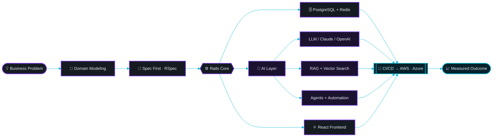
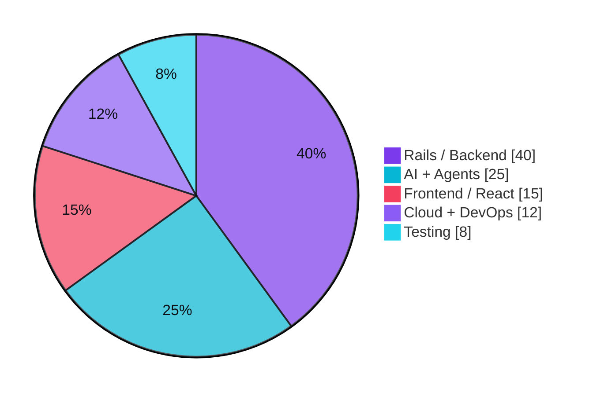
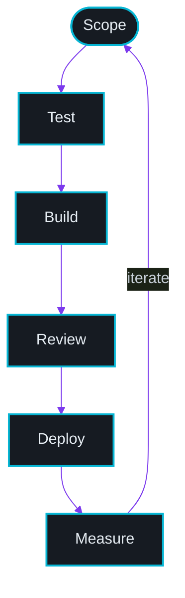

<!-- ═══════════════════════════ HEADER ═══════════════════════════ -->

<div align="center">
  
</div>

<div align="center">
  <a href="https://waseemakram.cc">
    
  </a>
</div>

<div align="center">

<a href="https://waseemakram.cc"></a>
<a href="https://linkedin.com/in/waseem-akram15"></a>
<a href="mailto:seemakram15@gmail.com"></a>


</div>

<div align="center">
  
</div>

<!-- ═══════════════════════════ ABOUT ═══════════════════════════ -->

## 👨‍💻 &nbsp;whoami

<table>
<tr>
<td width="60%" valign="top">

```ruby
class WaseemAkram < Developer
  ROLE  = "Full-Stack Engineer · AI Builder"
  STACK = %w[Rails React PostgreSQL Redis AWS]

  def currently_building
    [
      "Enterprise-grade web platforms",
      "AI agents & agentic workflows",
      "RAG pipelines over private data"
    ]
  end

  def ask_me_about
    %i[rails react system_design
       llm_integration api_architecture]
  end

  def reach_me
    { web:   "waseemakram.cc",
      mail:  "seemakram15@gmail.com",
      linkedin: "waseem-akram15" }
  end
end
```

</td>
<td width="40%" valign="top">

**Focus right now**

`🔭` Enterprise web apps + AI products
`🤖` LLMs · Agents · RAG · Automation
`🌱` Agentic AI & multi-agent systems
`⚡` Performance & database architecture
`🧪` TDD with RSpec, CI/CD pipelines
`💬` Rails · React · System design

**Working style**

`▸` Ship small, ship often
`▸` Boring tech, clever architecture
`▸` Tests before confidence
`▸` Business outcome > line count

</td>
</tr>
</table>

<div align="center">
  
</div>

<!-- ═══════════════════════════ TECH ═══════════════════════════ -->

## ⚙️ &nbsp;Tech Arsenal

<table align="center">
<tr>
<td align="center" width="140"><b>Languages</b></td>
<td align="center"></td>
</tr>
<tr>
<td align="center" width="140"><b>Frameworks</b></td>
<td align="center"></td>
</tr>
<tr>
<td align="center" width="140"><b>Data</b></td>
<td align="center"></td>
</tr>
<tr>
<td align="center" width="140"><b>Cloud &amp; DevOps</b></td>
<td align="center"></td>
</tr>
<tr>
<td align="center" width="140"><b>Tooling</b></td>
<td align="center"></td>
</tr>
</table>

<div align="center">

**AI &amp; Generative AI**


**Backend &amp; Quality**


</div>

<!-- ═══════════════════════════ PROFICIENCY ═══════════════════════════ -->

## 📊 &nbsp;Proficiency Map

<table>
<tr><td width="50%" valign="top">

**Core Engineering**

| Skill | Depth | |
|:--|:--|--:|
| Ruby on Rails | `███████████████████░` | **96%** |
| PostgreSQL / SQL | `██████████████████░░` | **92%** |
| REST &amp; API Design | `██████████████████░░` | **90%** |
| JavaScript / ES6+ | `█████████████████░░░` | **88%** |
| React &amp; Redux | `████████████████░░░░` | **84%** |
| RSpec / TDD | `█████████████████░░░` | **88%** |

</td><td width="50%" valign="top">

**AI &amp; Platform**

| Skill | Depth | |
|:--|:--|--:|
| LLM Integration | `██████████████████░░` | **92%** |
| AI Agents / Workflows | `█████████████████░░░` | **88%** |
| RAG Pipelines | `████████████████░░░░` | **85%** |
| Cloud &amp; DevOps | `████████████████░░░░` | **83%** |
| Redis / Sidekiq | `█████████████████░░░` | **87%** |
| System Design | `█████████████████░░░` | **89%** |

</td></tr>
</table>

<!-- ═══════════════════════════ DIAGRAMS ═══════════════════════════ -->

## 🧠 &nbsp;How I Build



<table>
<tr><td width="50%">

**Where the work goes**



</td><td width="50%">

**Delivery loop**



</td></tr>
</table>

<div align="center">
  
</div>

<!-- ═══════════════════════════ ANALYTICS ═══════════════════════════ -->

## 📈 &nbsp;GitHub Analytics

<div align="center">


</div>

<!-- ═══════════════════════════ EXPERTISE ═══════════════════════════ -->

## 🌟 &nbsp;What I'm Hired For

<table align="center">
<tr>
<td width="33%" align="center" valign="top">

### 🛠️
**Rails Engineering**

Multi-tenant SaaS · Complex domain models · Background jobs with Sidekiq · Query &amp; index tuning · Legacy upgrade paths

</td>
<td width="33%" align="center" valign="top">

### 🤖
**AI Product Work**

LLM feature design · Claude &amp; OpenAI integration · RAG over private data · Agentic workflows · Prompt evaluation

</td>
<td width="33%" align="center" valign="top">

### ☁️
**Platform &amp; Delivery**

AWS Elastic Beanstalk · Azure · CI/CD pipelines · Zero-downtime deploys · Monitoring &amp; performance budgets

</td>
</tr>
<tr>
<td align="center" valign="top">

### 🔌
**API Architecture**

REST &amp; GraphQL design · Versioning strategy · Third-party &amp; payment integrations · Webhooks at scale

</td>
<td align="center" valign="top">

### ⚛️
**Frontend**

React + Redux apps · Component systems · Responsive UI · Hotwire / Turbo in Rails · Accessibility basics

</td>
<td align="center" valign="top">

### 🧪
**Quality**

TDD with RSpec · Integration &amp; request specs · Coverage that means something · Refactoring under tests

</td>
</tr>
</table>

<div align="center">

`Problem Solving` &nbsp;·&nbsp; `Technical Leadership` &nbsp;·&nbsp; `Team Collaboration` &nbsp;·&nbsp; `Clear Communication` &nbsp;·&nbsp; `Agile Adaptability` &nbsp;·&nbsp; `Critical Thinking`

</div>

<div align="center">
  
</div>

<!-- ═══════════════════════════ CONTRIB SNAKE ═══════════════════════════ -->

<div align="center">

### 🐍 &nbsp;Contribution Graph, Eaten

<picture>
  <source media="(prefers-color-scheme: dark)" srcset="https://raw.githubusercontent.com/seemakram15/seemakram15/output/github-contribution-grid-snake-dark.svg" />
  <source media="(prefers-color-scheme: light)" srcset="https://raw.githubusercontent.com/seemakram15/seemakram15/output/github-contribution-grid-snake.svg" />
  
</picture>

</div>

<!-- ═══════════════════════════ FOOTER ═══════════════════════════ -->

<div align="center">

## 🤝 &nbsp;Let's Build Something

<a href="https://waseemakram.cc"></a>
<a href="https://linkedin.com/in/waseem-akram15"></a>
<a href="mailto:seemakram15@gmail.com"></a>

<br /><br />

<i>Open to collaborations on Rails platforms, AI products, and agentic systems.</i>


</div>
